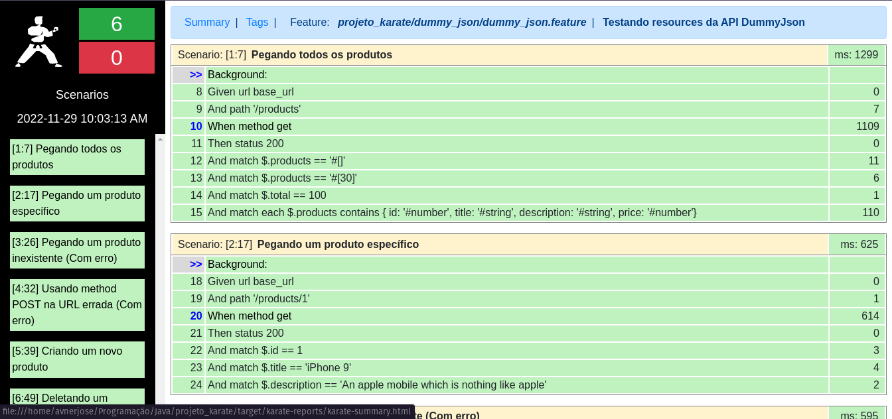

# Projeto de qualidade de software - S206 - Testes com Karate
### ✏️ Descrição do projeto
    
Este projeto possui testes de API desenvolvidos com o Karate, para validar o projeto 2 da disciplina de qualidade de software no INATEL.



### 📚 Arquivos importantes do projeto:

- src/test/java/projeto_karate/dummy_json
  - dummy_json.feature: Casos de teste desenvolvidos
  - DummyJson.java: Runner do Karate
  - json_product.json: Arquivo .json utilizado para o teste com o método POST

### 🖥️ API testada:
- [DummyJSON](https://dummyjson.com/)

### ⚙️ Dependências

- [Maven](https://maven.apache.org/)

### 🚀 Executando o projeto

1 - Clone o repositório

``` bash
git clone https://github.com/avnerjose/INATEL-S206-projeto-karate.git && cd INATEL-S206-projeto-karate
```

2 - Executar os testes do Karate e gerar relatório de testes
```bash 
mvn test -Dtest=DummyJson
```

3 - Abrir o relatório de testes 

```bash
Arraste o arquivo criado em target/karate-reports/karate-summary.html para o navegador.
```